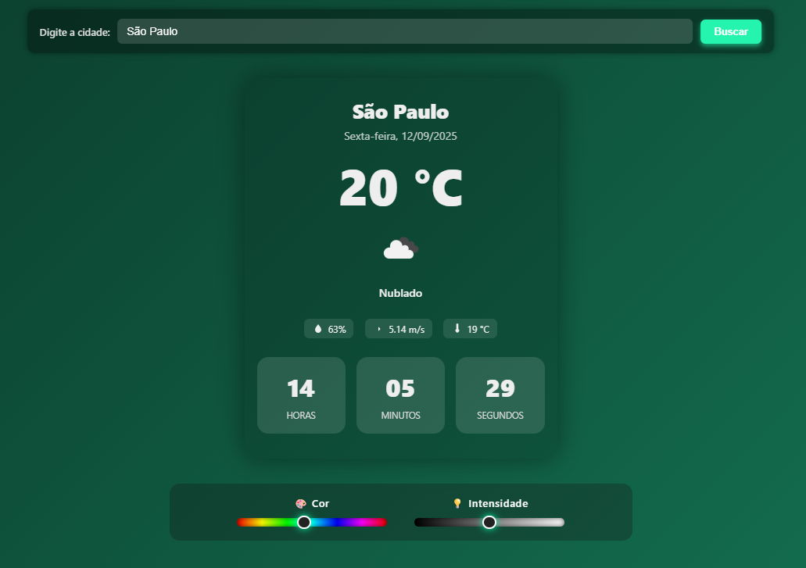

# 🌎 Sistema de Hora Digital com Clima em Tempo Real

Um sistema desenvolvido para exibir a **hora digital** junto com a **situação climática de qualquer região do mundo**.  
Basta digitar o nome da cidade no campo de pesquisa e o sistema mostra instantaneamente a hora local e o clima atualizado.

---

## ⚡ Funcionalidades

- 🕒 Exibição da hora digital em tempo real.
- 🌤️ Mostra a condição climática atual (temperatura, clima, ícones correspondentes).
- 🌍 Busca cidades de todo o mundo.
- 🔄 Atualização instantânea conforme a cidade é digitada.
- 📱 Interface responsiva e fácil de usar.

---

## 🖼️ Demonstração

<p align="center">
  
</p>

---

## 🛠️ Tecnologias utilizadas

- HTML5  
- CSS3  
- JavaScript  
- APIs de clima e localização de cidades  

---

## 🚀 Como usar

1. Clone o repositório:
   ```bash
   git clone https://github.com/maelgamer998/hora-clima.git
